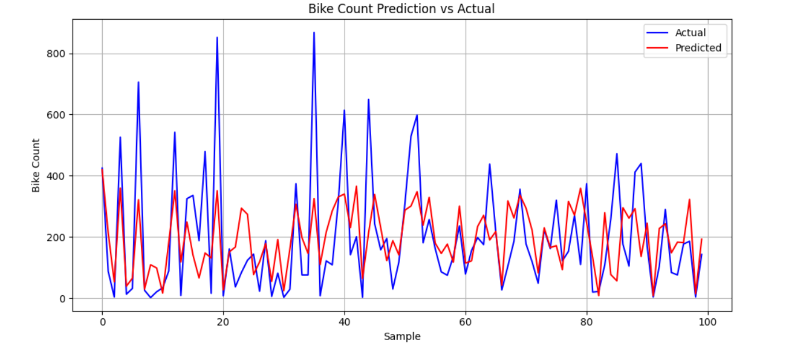

# Bike Rental Demand Prediction 🚴‍♂️

## PROBLEM STATEMENT
In urban cities, rental bikes are used for easy transportation. Predicting the number of bikes needed each hour is important for reducing waiting time and managing supply efficiently.

## PROPOSED SOLUTION
We use machine learning to predict hourly bike demand using weather and time-related data. This ensures better resource allocation for bike-sharing services.

## SYSTEM DEVELOPMENT APPROACH
- **Programming Language**: Python
- **Libraries**: pandas, matplotlib, sklearn, numpy
- **Dataset**: [UCI Bike Sharing Dataset](https://archive.ics.uci.edu/ml/datasets/bike+sharing+dataset)

## ALGORITHM & DEPLOYMENT
- **Algorithm Used**: Linear Regression (can be upgraded to LSTM)
- **Inputs**: Temperature, Humidity, Wind speed, Hour
- **Training Method**: Train-Test Split
- **Evaluation**: MAE, RMSE

## RESULT
The model shows good prediction accuracy. Below is a comparison of actual vs predicted counts.

## CONCLUSION
The model effectively predicts bike rentals per hour. With accurate data and more features, the prediction can be improved for real-time systems.

## FUTURE SCOPE
- Use LSTM for better time-series performance
- Add real-time weather API
- Deploy as a web app using Flask or Streamlit
- Expand to other cities

## REFERENCES
- UCI ML Repository: Bike Sharing Dataset
- scikit-learn Documentation
- Towards Data Science: Time Series Forecasting

## GitHub Link
[GitHub Repository](https://github.com/samarth02045/Bike-Rental-Prediction)
